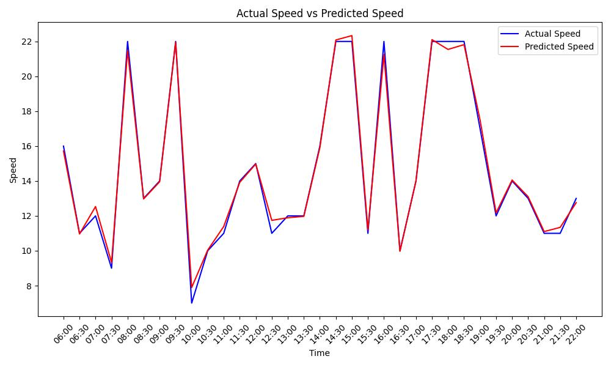

README for Stacking Model Algorithm

Project Overview
This project aims to develop a high-accuracy predictive model to estimate vehicle speeds using machine learning techniques. The model leverages a custom stacking algorithm combining multiple regression models to enhance predictive performance. The processed data and the model evaluation are visualized using Matplotlib to ensure clarity and effectiveness.

Features
Data Collection & Preprocessing: Cleaned and filtered a large dataset to focus on relevant time periods and locations.

Predictive Modeling: Utilized advanced machine learning algorithms to build and evaluate predictive models.

Ensemble Methods: Implemented a stacking model combining multiple regressors for improved accuracy.

Performance Evaluation: Assessed model performance using metrics such as R-squared and Mean Squared Error.

Visualization: Plotted actual vs. predicted speeds to validate model accuracy.

Technologies Used
Programming Languages: Python

Data Manipulation: pandas, numpy

Machine Learning Libraries: Scikit-Learn, CatBoost, XGBoost

Modeling Techniques: Gradient Boosting, Random Forest, Decision Tree, Ridge, Lasso, SVR, StackingCVRegressor

Hyperparameter Tuning: GridSearchCV

Data Preprocessing: StandardScaler, OneHotEncoder, ColumnTransformer, Pipeline

Model Evaluation: r2_score, mean_squared_error

Visualization: Matplotlib

Usage
Load the dataset and preprocess the data to focus on the relevant time period and locations.

Define input features and target variable, and apply a column transformer for data preprocessing.

Split the data into training and testing sets for model evaluation.

Train multiple models using a grid search for hyperparameter tuning and evaluate their performance.

Implement a stacking regressor to combine the predictions of individual models for improved accuracy.

Visualize the actual vs. predicted speeds using Matplotlib to assess the model's performance.

Visualization
The following graph illustrates the actual vs. predicted vehicle speeds, showcasing the model's predictive accuracy.
